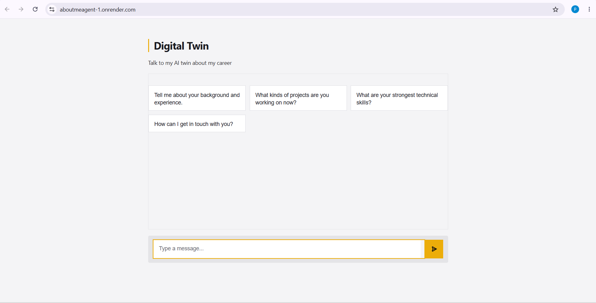
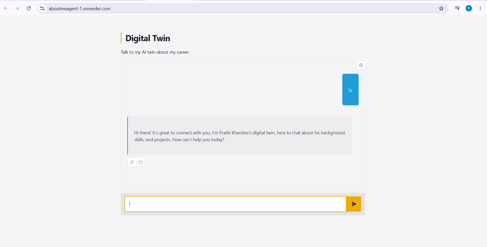

# 🤖 Digital Twin AI

An AI-powered Digital Twin chatbot that represents my professional profile and answers questions about my career, skills, projects, and experience. Built using Gradio and the Gemini API (OpenAI-compatible endpoint), the chatbot can also collect visitor contact details for follow-up.

---

## 🚀 Features

- 💬 Interactive AI chatbot with a modern Gradio interface
- 🧠 Uses Gemini 2.5 Flash Lite through the OpenAI-compatible API
- 📄 Reads LinkedIn profile information from a PDF
- 📝 Loads additional personal information from a summary file
- 📧 Records visitor email addresses for follow-up
- 🔔 Sends notifications using the Pushover API
- 🛠️ Supports OpenAI Function Calling (Tool Calling)
- 🌐 Deployable on Render

---

## 🛠️ Tech Stack

- Python 3.12
- Gradio
- Google Gemini API
- OpenAI Python SDK
- PyPDF
- Requests
- Python-dotenv

---

## 📂 Project Structure

```
DigitalTwin/
│
├── app.py                # Main Gradio application
├── tools.py              # Function calling tools
├── context.py            # Loads LinkedIn PDF & summary
├── style.py              # Custom CSS, JS & examples
├── linkedin.pdf          # LinkedIn profile
├── summary.txt           # Career summary
├── requirements.txt
├── .env
└── README.md
```

---

## ⚙️ Installation

Clone the repository:

```bash
git clone https://github.com/yourusername/AboutmeAgent.git
cd AboutmeAgent
```

Create a virtual environment:

```bash
python -m venv .venv
```

Activate it:

### Windows

```bash
.venv\Scripts\activate
```

### Linux / macOS

```bash
source .venv/bin/activate
```

Install dependencies:

```bash
pip install -r requirements.txt
```

---

## 🔑 Environment Variables

Create a `.env` file in the project root.

```env
Gemini_API_KEY=YOUR_GEMINI_API_KEY

PUSHOVER_USER=YOUR_PUSHOVER_USER

PUSHOVER_TOKEN=YOUR_PUSHOVER_TOKEN
```

---

## ▶️ Run the Application

```bash
python app.py
```

or

```bash
uv run app.py
```

---

## 🌍 Deployment

This project can be deployed on **Render**.
## 🌐 Live Demo

🔗 https://aboutmeagent-1.onrender.com/

---

### Build Command

```bash
pip install -r requirements.txt
```

### Start Command

```bash
python app.py
```

---

## 📌 How It Works

1. Loads career information from `summary.txt`.
2. Reads LinkedIn data from `linkedin.pdf`.
3. Creates a Digital Twin system prompt.
4. Sends conversations to Gemini.
5. Uses Function Calling to:
   - Save visitor emails
   - Record unknown questions
6. Sends notifications through Pushover.

---


```
screenshots/
```
---
### 💬 Chat Interface



## 🔮 Future Improvements

- Resume upload support
- Conversation memory
- Dark/Light theme
- Voice interaction
- Multi-language support
- Admin dashboard for collected leads

---

## 👨‍💻 Author

**Pratik Bapusaheb Khandve**

- LinkedIn: https://www.linkedin.com/in/pratik-khandve-b2340a300/
- GitHub: https://github.com/pratikkhandve55

---

